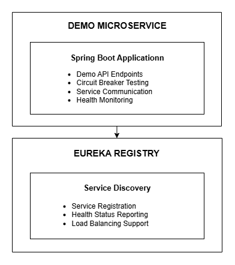

# Bilibili Demo Microservice

## 1 - Overview

The **Bilibili Demo Microservice** is a demonstration service that showcases microservices patterns, circuit breaker implementation, and inter-service communication in the Bilibili video streaming platform. It provides simple API endpoints for testing and demonstrating various microservices concepts.

## 2 - Purpose

- **Demo APIs**: Simple CRUD operations for demonstration
- **Circuit Breaker Testing**: Timeout and failure testing endpoints
- **Service Communication**: Inter-service communication examples
- **Microservices Patterns**: Showcase common microservices patterns

## 3 - Architecture



## 4 - Technology Stack

- **Spring Boot 3.1.6**: Main framework
- **Netflix Eureka Client**: Service discovery
- **Java 17**: Runtime environment
- **Spring Boot Actuator**: Health checks and monitoring
- **Docker**: Containerization support

## 5 - Quick Start

### **Prerequisites**
- Java 17+
- Maven 3.6+
- Eureka server running

### **Local Development**
```bash
# Clone the repository
git clone https://github.com/Billy423/bilibili-microservice.git && \
  cd bilibili-microservice

# Build the application
mvn clean package

# Run the application
mvn spring-boot:run
```

### **Docker Deployment**
```bash
# Build Docker image
docker build -t bilibili-ms .

# Run container
docker run -p 15007:15007 bilibili-ms
```

### **Using Docker Compose**
```bash
# From the main bilibili project directory
docker compose -f docker-compose.microservices.yml up bilibili-ms
```

## 6 - Configuration

### **Key Properties**
- **Port**: 15007
- **Service Name**: bilibili-ms-api
- **Eureka**: Auto-registration with service discovery
- **Health Checks**: Actuator endpoints enabled

## 7 - API Endpoints

### **Demo CRUD Operations**
- **GET /demos**: Get demo data by ID
- **POST /demos**: Create/update demo data

### **Circuit Breaker Testing**
- **GET /timeout**: Simulates slow service response for testing circuit breaker patterns

## 8 - Key Features

- **Simple API Endpoints**: Basic CRUD operations and data echoing
- **Circuit Breaker Testing**: Timeout simulation and failure testing
- **Service Discovery**: Eureka integration with health monitoring
- **Monitoring**: Spring Boot Actuator health endpoints and metrics

## 9 - Monitoring & Health Checks

### **Health Endpoints**
- **Health Check**: `http://localhost:15007/actuator/health`
- **Info**: `http://localhost:15007/actuator/info`
- **Metrics**: `http://localhost:15007/actuator/metrics`

### **Service Status**
- **Eureka Dashboard**: View service status at `http://localhost:15006/`
- **Service Instance**: Check service registration and health

## 10 - Deployment

### **Development Environment**
```bash
# Start dependencies and service
cd ../bilibili-eureka && mvn spring-boot:run && \
  cd ../bilibili-ms && mvn spring-boot:run
```

### **Production Environment**
```bash
# Build and run with Docker
docker build -t bilibili-ms . && \
  docker run -d -p 15007:15007 --name bilibili-ms bilibili-ms
```

### **Multi-Service Deployment**
```bash
# Start all microservices
cd /path/to/bilibili && make ms-up
```

## 11 - Development

### **Project Structure**
```
bilibili-ms/
├── src/main/java/org/example/
│   ├── App.java
│   └── bilibili/api/DemoApi.java
├── src/main/resources/application*.properties
├── Dockerfile
└── pom.xml
```

### **Key Classes**
- **`App.java`**: Main Spring Boot application with Eureka client
- **`DemoApi.java`**: REST controller with demo endpoints

## 12 - Related Services

- **[Eureka Server](https://github.com/Billy423/bilibili-eureka)**: Service discovery
- **[API Gateway](https://github.com/Billy423/bilibili-api-gateway)**: Centralized routing
- **[Main API Service](https://github.com/Billy423/bilibili)**: Core business logic
- **[Frontend](https://github.com/Billy423/bilibili-vue)**: Vue.js interface

---

**This demo microservice showcases microservices patterns and serves as a testing ground.**